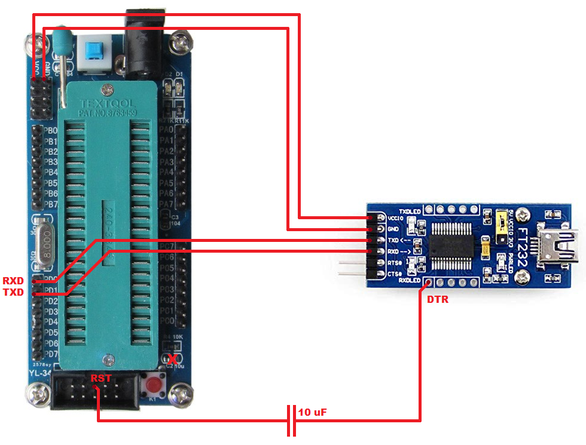

# atmega16_platformio_example
The example PlatformIO project with Arduino framework.

## Arduino Bootloader
The bootloader can be uploaded to the Atmega16 using: [Arduino IDE](https://www.arduino.cc/en/Main/Software) + [MightyCore](https://github.com/MCUdude/MightyCore#how-to-install) + USBasp/arduinoISP

## Programming
### Schematic

> **NOTE:** The C2 capacitor (connected to the reset pin) should be removed

### PlatformIO
Just upload a compiled program, such as the standard Arduino code.
Please be sure about "board_build.f_cpu" param in the platformio.ini file.
